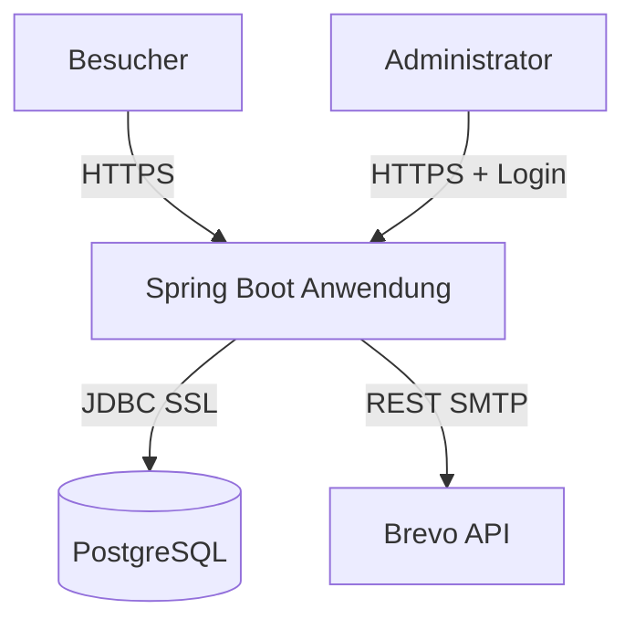
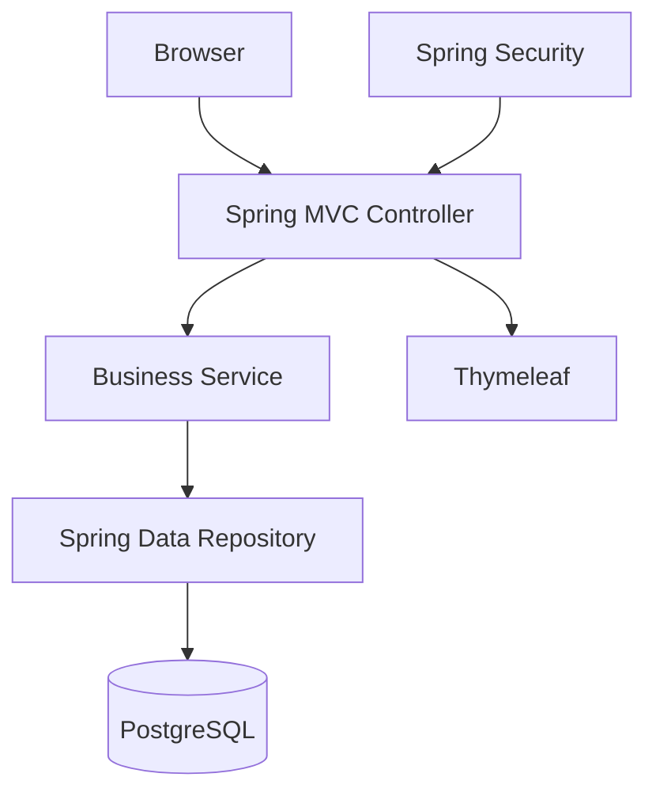
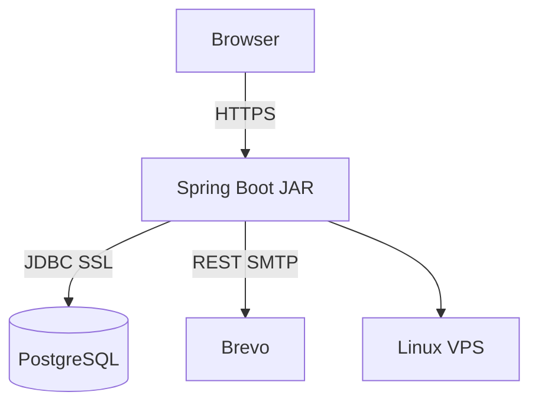

# Architekturdokumentation arc42 
# Webpräsenz mit integriertem CMS, CRM und Shop

Diese Dokumentation beschreibt die Softwarearchitektur einer integrierten Webpräsenz mit CMS-, CRM- und Shop-Funktionalität basierend auf dem arc42-Template.

---

# Inhaltsverzeichnis

<details>
<summary><b>Inhaltsverzeichnis aufklappen / zuklappen</b></summary>
- [1. Anforderungen und Randbedingungen](#1-anforderungen-und-randbedingungen)
  - [1.1 Aufgabenstellung](#11-aufgabenstellung)
  - [1.2 Qualitätsziele](#12-qualitätsziele)
  - [1.3 Randbedingungen](#13-randbedingungen)

- [2. Architekturüberblick & Randbedingungen](#2-architekturüberblick--randbedingungen)
  - [2.1 Technische Randbedingungen](#21-technische-randbedingungen)
  - [2.2 Organisatorische Randbedingungen](#22-organisatorische-randbedingungen)
  - [2.3 Rechtliche Randbedingungen](#23-rechtliche-randbedingungen)

- [3. Kontextabgrenzung](#3-kontextabgrenzung)
  - [3.1 Fachlicher Kontext](#31-fachlicher-kontext)
  - [3.2 Technischer Kontext](#32-technischer-kontext)

- [4. Lösungsstrategie](#4-lösungsstrategie)
  - [4.1 Architekturansatz](#41-architekturansatz)
  - [4.2 Verzicht auf komplexe Frontend-Frameworks](#42-verzicht-auf-komplexe-frontend-frameworks)
  - [4.3 Einsatz von htmx](#43-einsatz-von-htmx)
  - [4.4 MVC-Architekturprinzip](#44-mvc-architekturprinzip)
  - [4.5 Spring Boot als technologische Basis](#45-spring-boot-als-technologische-basis)
  - [4.6 Maven als Buildsystem](#46-maven-als-buildsystem)
  - [4.7 Clean-Code-Strategie](#47-clean-code-strategie)

- [5. Bausteinsicht](#5-bausteinsicht)
  - [5.1 Komponentenübersicht](#51-komponentenübersicht)
  - [5.2 Projektstruktur](#52-projektstruktur)
  - [5.3 Verantwortlichkeiten](#53-verantwortlichkeiten)
  - [5.4 MVC Request-Flow](#54-mvc-request-flow)

- [6. Laufzeitsicht](#6-laufzeitsicht)
  - [6.1 Warenkorb aktualisieren](#61-warenkorb-aktualisieren)
  - [6.2 Blogeintrag löschen](#62-blogeintrag-löschen)

- [7. Verteilungssicht](#7-verteilungssicht)
  - [7.1 Infrastrukturübersicht](#71-infrastrukturübersicht)
  - [7.2 Deployment](#72-deployment)
  - [7.3 Infrastruktur](#73-infrastruktur)

- [8. Querschnittliche Konzepte](#8-querschnittliche-konzepte)
  - [8.1 Sicherheit](#81-sicherheit)
  - [8.2 htmx + CSRF](#82-htmx--csrf)
  - [8.3 Coding Standards](#83-coding-standards)
  - [8.4 Logging](#84-logging)
  - [8.5 Fehlerbehandlung](#85-fehlerbehandlung)
  - [8.6 JavaDoc-Richtlinien](#86-javadoc-richtlinien)
  - [8.7 Maven Dependency Management](#87-maven-dependency-management)
  - [8.8 Spring Profiles](#88-spring-profiles)
  - [8.9 Konfigurationsmanagement](#89-konfigurationsmanagement)
  - [8.10 Teststrategie](#810-teststrategie)

- [9. Architekturentscheidungen (ADR)](#9-architekturentscheidungen-adr)
  - [ADR 1: htmx statt React](#adr-1-htmx-statt-react)
  - [ADR 2: Spring Boot](#adr-2-spring-boot)
  - [ADR 3: Maven](#adr-3-maven)
  - [ADR 4: MVC Pattern](#adr-4-mvc-pattern)
  - [ADR 5: Constructor Injection](#adr-5-constructor-injection)

- [10. Qualitätsanforderungen](#10-qualitätsanforderungen)

- [11. Risiken und technische Schulden](#11-risiken-und-technische-schulden)
  - [11.1 Out-of-Memory Risiko](#111-out-of-memory-risiko)
  - [11.2 Session-Skalierung](#112-session-skalierung)
  - [11.3 Veraltete Dependencies](#113-veraltete-dependencies)
  - [11.4 Fehlende Dokumentation](#114-fehlende-dokumentation)

- [12. Glossar](#12-glossar)
</details>


---

# 1. Anforderungen und Randbedingungen

## 1.1 Aufgabenstellung

Das System dient der Bereitstellung einer integrierten Webplattform mit folgenden Kernbereichen:

### CMS

- Öffentliche Blog- und Newsbeiträge
- Administrationsbereich zur Inhaltspflege
- Bildverwaltung

### Mini-Shop

- Produktübersicht
- Warenkorbverwaltung
- Sessionbasierter Warenkorb

### CRM

- Newsletter-Anmeldung
- E-Mail-Validierung
- Newsletter-Versand

---

## 1.2 Qualitätsziele

| Qualitätsziel | Beschreibung |
|---|---|
| Time-to-Market | Livegang innerhalb von 2 Wochen |
| Kosteneffizienz | Betriebskosten unter 2 € |
| Sicherheit | Schutz gegen Standardangriffe |
| Wartbarkeit | Strukturierte Architektur |
| Testbarkeit | Isolierte Geschäftslogik |
| Verständlichkeit | Klare Projektstruktur |

---

## 1.3 Randbedingungen

### Technologische Vorgaben

- Java 21
- Spring Boot
- Maven
- PostgreSQL
- Thymeleaf
- htmx
- Kein eigenes JavaScript

### Organisatorische Vorgaben

- 1 Entwickler
- Kurze Entwicklungszeit

### Rechtliche Vorgaben

- DSGVO-Konformität
- HTTPS Pflicht
- Sichere Passwortspeicherung

---

# 2. Architekturüberblick & Randbedingungen

## 2.1 Technische Randbedingungen

| Bereich | Vorgabe |
|---|---|
| RAM | Max. 1 GB |
| JVM Heap | `-Xmx512m` |
| Datenbank | PostgreSQL |
| Laufzeit | OpenJDK 21 |
| Deployment | Linux VPS |

---

## 2.2 Organisatorische Randbedingungen

- Fokus auf Einfachheit
- Minimale Betriebskosten
- Wartbar durch Einzelentwickler

---

## 2.3 Rechtliche Randbedingungen

- DSGVO-konforme Verarbeitung personenbezogener Daten
- Datenschutzerklärung
- Cookie- und Session-Sicherheit

---

# 3. Kontextabgrenzung

## Systemkontext



---

## 3.1 Fachlicher Kontext

### Besucher

- Lesen Inhalte
- Nutzen den Shop
- Registrieren sich für Newsletter

### Administratoren

- Verwalten Inhalte
- Pflegen Produkte
- Starten Mailkampagnen

---

## 3.2 Technischer Kontext

| Schnittstelle | Technologie |
|---|---|
| Browser ↔ Backend | HTTPS |
| Backend ↔ DB | JDBC |
| Backend ↔ Mail | REST / SMTP |

---

# 4. Lösungsstrategie

## 4.1 Architekturansatz

Die Anwendung wird als serverseitiger Spring-Boot-Monolith umgesetzt.

### Eigenschaften

- Eine deploybare Anwendung
- Embedded Tomcat
- MVC-Architektur
- Sessionbasiert
- Serverseitiges Rendering

---

## 4.2 Verzicht auf komplexe Frontend-Frameworks

Es wird bewusst auf React, Angular oder Vue verzichtet.

### Gründe

- Schnellere Entwicklung
- Geringere Komplexität
- Kein Node.js notwendig
- Geringerer Wartungsaufwand

---

## 4.3 Einsatz von htmx

htmx ermöglicht dynamische Interaktionen direkt über HTML-Attribute.

### Beispiele

- Warenkorb aktualisieren
- Tabellen dynamisch verändern
- Formulare validieren

---

## 4.4 MVC-Architekturprinzip

Die Anwendung nutzt konsequent das MVC-Pattern.

### Ziele

- Trennung von Verantwortlichkeiten
- Gute Testbarkeit
- Hohe Wartbarkeit

---

## 4.5 Spring Boot als technologische Basis

| Komponente | Aufgabe |
|---|---|
| Spring Boot | Basisframework |
| Spring MVC | Webarchitektur |
| Spring Security | Sicherheit |
| Spring Data JPA | Datenzugriff |
| Thymeleaf | Template Engine |
| Hibernate | ORM |
| Validation API | Validierung |

---

## 4.6 Maven als Buildsystem

Maven übernimmt Build-, Dependency- und Lifecycle-Management.

### Ziele

- Reproduzierbare Builds
- Einheitliche Build-Pipeline
- Dependency-Verwaltung

---

## 4.7 Clean-Code-Strategie

### Regeln

- Kleine Klassen
- Verständliche Methodennamen
- Constructor Injection
- Keine Businesslogik in Controllern
- Single Responsibility Principle

---

# 5. Bausteinsicht

## 5.1 Komponentenübersicht



---

## 5.2 Projektstruktur

```text
src/main/java/de/example/app
│
├── cms
├── crm
├── shop
├── security
├── shared
└── Application.java
```

---

## 5.3 Verantwortlichkeiten

| Schicht | Aufgabe |
|---|---|
| Controller | HTTP Requests |
| Service | Geschäftslogik |
| Repository | Persistenz |
| View | Rendering |
| Security | Authentifizierung |

---

## 5.4 MVC Request-Flow

```mermaid
sequenceDiagram

    actor User

    participant Controller
    participant Service
    participant Repository
    participant DB

    User->>Controller: HTTP Request

    Controller->>Service:
        Business Operation

    Service->>Repository:
        Datenzugriff

    Repository->>DB:
        SQL Query

    DB-->>Repository:
        Daten

    Repository-->>Service:
        Entity

    Service-->>Controller:
        Ergebnis
```

---

# 6. Laufzeitsicht

## 6.1 Warenkorb aktualisieren

```mermaid
sequenceDiagram

    actor User

    participant htmx
    participant Controller
    participant Session

    User->>htmx:
        Klick "In Warenkorb"

    htmx->>Controller:
        POST /cart/add

    Controller->>Session:
        Artikel hinzufügen

    Session-->>Controller:
        Aktualisierter Warenkorb

    Controller-->>htmx:
        HTML Fragment

    htmx-->>User:
        DOM Update
```

---

## 6.2 Blogeintrag löschen

```mermaid
sequenceDiagram

    actor Admin

    participant htmx
    participant Controller
    participant DB

    Admin->>htmx:
        DELETE Aktion

    htmx->>Controller:
        DELETE /blog/45

    Controller->>DB:
        DELETE SQL

    DB-->>Controller:
        OK
```

---

# 7. Verteilungssicht

## 7.1 Infrastrukturübersicht



---

## 7.2 Deployment

### Build

```bash
./mvnw clean package
```

### Start

```bash
java -Xmx512m -jar app.jar
```

---

## 7.3 Infrastruktur

| Komponente | Beschreibung |
|---|---|
| VPS | Ubuntu Linux |
| Java | OpenJDK 21 |
| Datenbank | PostgreSQL |
| Mailservice | Brevo |

---

# 8. Querschnittliche Konzepte

## 8.1 Sicherheit

### Sicherheitsmaßnahmen

- Spring Security
- CSRF Schutz
- HTTPS
- Session Management
- HttpOnly Cookies

---

## 8.2 htmx + CSRF

```html
<body hx-headers='js:{
  "X-CSRF-TOKEN":
  document.querySelector(
    "meta[name=_csrf]"
  ).getAttribute("content")
}'>
```

---

## 8.3 Coding Standards

| Regel | Vorgabe |
|---|---|
| Einrückung | 4 Leerzeichen |
| UTF-8 | Pflicht |
| Zeilenlänge | 120 Zeichen |
| Constructor Injection | Verpflichtend |

---

## 8.4 Logging

```java
private static final Logger log =
    LoggerFactory.getLogger(ShopService.class);

log.info(
    "Artikel {} hinzugefügt",
    productId
);
```

---

## 8.5 Fehlerbehandlung

```java
@ControllerAdvice
public class GlobalExceptionHandler {

    @ExceptionHandler(ProductNotFoundException.class)
    public String handleProductNotFound() {
        return "error/404";
    }
}
```

---

## 8.6 JavaDoc-Richtlinien

### Öffentliche Klassen dokumentieren

```java
/**
 * Service zur Verwaltung des Warenkorbs.
 */
@Service
public class CartService {
}
```

---

### Öffentliche Methoden dokumentieren

```java
/**
 * Fügt ein Produkt hinzu.
 *
 * @param productId Produkt-ID
 * @param quantity Anzahl
 * @return Warenkorb
 */
public Cart addProduct(
        Long productId,
        int quantity) {
}
```

---

## 8.7 Maven Dependency Management

```xml
<project>

    <modelVersion>4.0.0</modelVersion>

    <parent>
        <groupId>
            org.springframework.boot
        </groupId>

        <artifactId>
            spring-boot-starter-parent
        </artifactId>

        <version>3.3.0</version>
    </parent>

</project>
```

---

## 8.8 Spring Profiles

| Profil | Aufgabe |
|---|---|
| dev | Entwicklung |
| test | Tests |
| prod | Produktion |

---

## 8.9 Konfigurationsmanagement

```yaml
spring:
  datasource:
    url:
      jdbc:postgresql://localhost:5432/app

server:
  port: 8080
```

---

## 8.10 Teststrategie

| Testtyp | Ziel |
|---|---|
| Unit Tests | Geschäftslogik |
| Integrationstests | Spring Kontext |
| Security Tests | Zugriffsschutz |
| UI Tests | Benutzerflows |

---

# 9. Architekturentscheidungen (ADR)

## ADR 1: htmx statt React

### Entscheidung

Server-Driven UI mit htmx.

### Vorteile

- Weniger Komplexität
- Schnellere Entwicklung
- Kein Frontend Buildsystem

---

## ADR 2: Spring Boot

### Entscheidung

Spring Boot als zentrales Framework.

### Vorteile

- Produktionsreife Komponenten
- Große Community
- PostgreSQL Unterstützung

---

## ADR 3: Maven

### Entscheidung

Apache Maven als Buildsystem.

### Vorteile

- Standardisierte Builds
- CI/CD Integration
- Gute IDE Unterstützung

---

## ADR 4: MVC Pattern

### Entscheidung

Klare Trennung von Controller, Service und Repository.

### Vorteile

- Wartbarkeit
- Testbarkeit
- Verständlichkeit

---

## ADR 5: Constructor Injection

### Entscheidung

Ausschließlich Constructor Injection.

### Vorteile

- Explizite Abhängigkeiten
- Immutable Services
- Gute Testbarkeit

---

# 10. Qualitätsanforderungen

| Qualitätsmerkmal | Lösung |
|---|---|
| Wartbarkeit | MVC + Clean Code |
| Sicherheit | Spring Security |
| Stabilität | Spring Boot |
| Testbarkeit | Service Layer |
| Deployment | Maven + Uber-JAR |
| Verständlichkeit | JavaDoc + ADRs |

---

# 11. Risiken und technische Schulden

## 11.1 Out-of-Memory Risiko

### Ursache

Spring Boot benötigt relativ viel RAM.

### Gegenmaßnahmen

- `-Xmx512m`
- Kleine Images
- Minimale Dependencies

---

## 11.2 Session-Skalierung

### Problem

Warenkorb liegt im RAM.

### Bewertung

Für kleine Last akzeptabel.

---

## 11.3 Veraltete Dependencies

### Risiko

Sicherheitslücken.

### Gegenmaßnahmen

- Regelmäßige Updates
- Security Scans
- Dependabot

---

## 11.4 Fehlende Dokumentation

### Risiko

Schlechtere Wartbarkeit.

### Gegenmaßnahmen

- JavaDoc Pflicht
- ADR Dokumentation
- arc42 Pflege

---

# 12. Glossar

| Begriff | Beschreibung |
|---|---|
| MVC | Model View Controller |
| Spring Boot | Java Enterprise Framework |
| htmx | HTML-basierte AJAX Bibliothek |
| Thymeleaf | Serverseitige Template Engine |
| Maven | Build- und Dependency-Tool |
| Uber-JAR | Ausführbare JAR |
| JavaDoc | Java Dokumentationsstandard |
| Dependency Injection | Übergabe von Abhängigkeiten |
| Constructor Injection | Injection per Konstruktor |
| ORM | Object Relational Mapping |
| JPA | Java Persistence API |
| Hibernate | ORM Framework |
| CSRF | Cross Site Request Forgery |
| ADR | Architecture Decision Record |