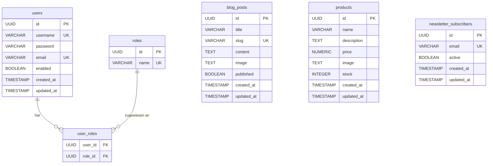

# Datenbankschema

## Übersicht

Die Anwendung ist in drei fachliche Module aufgeteilt: **Security**, **CMS** und **Shop/CRM**.
Das Schema ist für PostgreSQL ausgelegt (UUID-Primärschlüssel, `gen_random_uuid()`).
Migrationsskripte liegen unter `src/main/resources/db/migration/` und werden mit **Flyway** eingespielt.

---

## ER-Diagramm

---

## Tabellenbeschreibungen

### Security-Modul

#### `users`
Speichert alle Benutzerkonten der Anwendung.

| Spalte       | Typ           | Beschreibung                                  |
|--------------|---------------|-----------------------------------------------|
| `id`         | UUID (PK)     | Primärschlüssel, automatisch generiert        |
| `username`   | VARCHAR(255)  | Eindeutiger Benutzername                      |
| `password`   | VARCHAR(255)  | BCrypt-gehashtes Passwort                     |
| `email`      | VARCHAR(255)  | Eindeutige E-Mail-Adresse                     |
| `enabled`    | BOOLEAN       | Gibt an, ob das Konto aktiv ist               |
| `created_at` | TIMESTAMP     | Zeitpunkt der Kontoerstellung                 |
| `updated_at` | TIMESTAMP     | Zeitpunkt der letzten Änderung                |

#### `roles`
Definiert die verfügbaren Berechtigungsrollen.

| Spalte | Typ          | Beschreibung                                        |
|--------|--------------|-----------------------------------------------------|
| `id`   | UUID (PK)    | Primärschlüssel                                     |
| `name` | VARCHAR(50)  | Eindeutiger Rollenname (z. B. `ROLE_ADMIN`)         |

Standardrollen (via `V2__Seed_Default_Roles.sql`):
- `ROLE_ADMIN` — voller Zugriff inkl. Admin-Dashboard
- `ROLE_EDITOR` — Zugriff auf CMS-Admin
- `ROLE_USER` — Standardrolle für neu registrierte Kunden

#### `user_roles`
Verknüpfungstabelle (Many-to-Many) zwischen `users` und `roles`.

| Spalte    | Typ       | Beschreibung                        |
|-----------|-----------|-------------------------------------|
| `user_id` | UUID (FK) | Fremdschlüssel auf `users.id`       |
| `role_id` | UUID (FK) | Fremdschlüssel auf `roles.id`       |

Beide Spalten bilden gemeinsam den zusammengesetzten Primärschlüssel.
Beim Löschen eines Benutzers oder einer Rolle werden die Einträge automatisch entfernt (`ON DELETE CASCADE`).

---

### CMS-Modul

#### `blog_posts`
Speichert alle Blogbeiträge der Anwendung.

| Spalte       | Typ          | Beschreibung                                           |
|--------------|--------------|--------------------------------------------------------|
| `id`         | UUID (PK)    | Primärschlüssel                                        |
| `title`      | VARCHAR(255) | Titel des Beitrags                                     |
| `slug`       | VARCHAR(255) | URL-freundliche eindeutige Kennung (z. B. `mein-blog`) |
| `content`    | TEXT         | Vollständiger Inhalt des Beitrags                      |
| `image`      | TEXT         | Titelbild als Base64-kodierter String                  |
| `published`  | BOOLEAN      | `true` = veröffentlicht, `false` = Entwurf             |
| `created_at` | TIMESTAMP    | Erstellungszeitpunkt                                   |
| `updated_at` | TIMESTAMP    | Zeitpunkt der letzten Änderung                         |

---

### Shop-Modul

#### `products`
Speichert alle Produkte des Mini-Shops.

| Spalte        | Typ           | Beschreibung                                  |
|---------------|---------------|-----------------------------------------------|
| `id`          | UUID (PK)     | Primärschlüssel                               |
| `name`        | VARCHAR(255)  | Produktname                                   |
| `description` | TEXT          | Produktbeschreibung                           |
| `price`       | NUMERIC(10,2) | Preis (2 Dezimalstellen für Genauigkeit)      |
| `image`       | TEXT          | Produktbild als Base64-kodierter String       |
| `stock`       | INTEGER       | Aktueller Lagerbestand                        |
| `created_at`  | TIMESTAMP     | Erstellungszeitpunkt                          |
| `updated_at`  | TIMESTAMP     | Zeitpunkt der letzten Änderung                |

---

### CRM-Modul

#### `newsletter_subscribers`
Speichert alle Newsletter-Abonnenten.

| Spalte       | Typ          | Beschreibung                                    |
|--------------|--------------|-------------------------------------------------|
| `id`         | UUID (PK)    | Primärschlüssel                                 |
| `email`      | VARCHAR(255) | Eindeutige E-Mail-Adresse des Abonnenten        |
| `active`     | BOOLEAN      | `true` = aktives Abonnement, `false` = abgemeldet |
| `created_at` | TIMESTAMP    | Zeitpunkt der Registrierung                     |
| `updated_at` | TIMESTAMP    | Zeitpunkt der letzten Änderung                  |

---

## Indizes

| Index                              | Tabelle                  | Spalte     | Zweck                          |
|------------------------------------|--------------------------|------------|--------------------------------|
| `idx_users_username`               | `users`                  | `username` | Schneller Login-Lookup         |
| `idx_users_email`                  | `users`                  | `email`    | Prüfung auf E-Mail-Duplikate   |
| `idx_blog_posts_slug`              | `blog_posts`             | `slug`     | URL-Routing                    |
| `idx_products_name`                | `products`               | `name`     | Produktsuche                   |
| `idx_newsletter_subscribers_email` | `newsletter_subscribers` | `email`    | Prüfung auf Duplikate          |

---

## Migrationsskripte

| Datei                        | Inhalt                                                |
|------------------------------|-------------------------------------------------------|
| `V1__Initial_Schema.sql`     | Alle Tabellen und Indizes anlegen                     |
| `V2__Seed_Default_Roles.sql` | Standardrollen `ROLE_ADMIN`, `ROLE_EDITOR`, `ROLE_USER` einfügen |

> **Hinweis:** Die Anwendung verwendet aktuell dateibasierte Persistenz (`FilePersistenceService`).
> Dieses Schema ist für die Migration zu einer PostgreSQL-Datenbank vorbereitet.
> Für den Wechsel müssen Spring Data JPA sowie ein PostgreSQL-Treiber in die `pom.xml` aufgenommen
> und die Repositories auf JPA-Repositories umgestellt werden.
